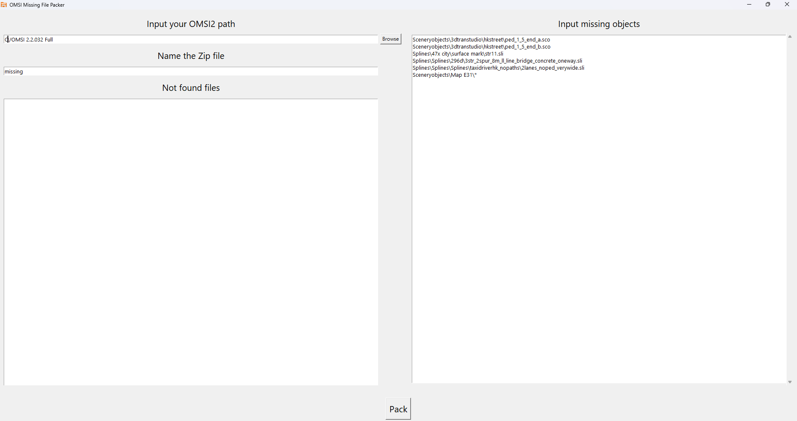

# OMSI FilePacker UI

Easily pack OMSI scenery objects, splines, and their associated textures/models into a single ZIP file from a provided list.

---

## Features

- Collects all required files (objects, splines, textures, models) based on your input list
- Supports packing entire folders (using `*` wildcard)
- Outputs a ready-to-use ZIP archive
- Optionally lists any missing files

---

## Quick Start

### 1. Download & Run

- **Recommended:** [Download OMSI Missing Files Packer UI (.exe)](https://github.com/KF8311/OMSI-FilePacker-UI/releases/latest/download/OMSI.File.Packer.exe)
    - No installation required. Just run the executable.

**OR**

- If you prefer Python, download both `frontend.py` and `backend.py` (remove any icon/ico references), and run `frontend.py` with Python 3.12+.
    - [Download Python](https://www.python.org/downloads/)
    - Run via PowerShell or Command Prompt for log output.

---
### 2. Prepare Your OMSI Directory

Press the folder icon in the UI to select your OMSI installation directory. This is where the program will look for the files listed in your input file.
After choosing the directory, close the app and reopen it to ensure the path is set correctly.

### 3. Prepare Your Input List

Create a text file (e.g., `file_paths.txt`) listing the scenery objects and splines you want to pack, one per line. To pack a whole folder, end the path with `\*`.

**Example:**

```txt
Sceneryobjects\3dtranstudio\hkstreet\ped_1_5_end_a.sco
Sceneryobjects\3dtranstudio\hkstreet\ped_1_5_end_b.sco
Splines\47x city\surface mark\str11.sli
Splines\Splines\296d\3str_2spur_8m_ll_line_bridge_concrete_oneway.sli
Splines\Splines\Splines\taxidriverhk_nopaths\2lanes_noped_verywide.sli
Sceneryobjects\Map E31\*
```

---

### 4. Run the Program


1. Run the program
2. Select your input file if prompted
3. The program will create a ZIP file with all found files
4. A log or list of missing files will be generated if any files are not found

---

## Credits

- [Thomas Mathieson – Blender o3d Plugin](https://github.com/space928/Blender-O3D-IO-Public)
- [KC x RT Workshop – Missing Files Packing Python Script](https://github.com/lmoadeck-Lunity/OMSI-FilePacker/tree/main)

---


