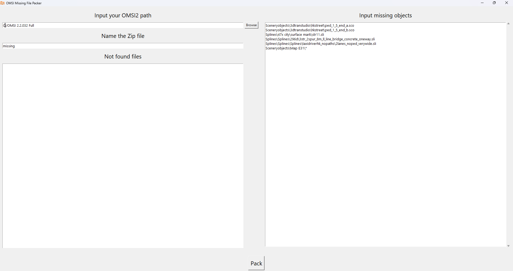

# OMSI-FilePacker

Packs scenery objects, splines, and their corresponding textures and models from a provided list.

- **Credit**  
  [Thomas Mathieson and his Blender o3d Plugin](https://github.com/space928/Blender-O3D-IO-Public) <br>
  [KC x RT Workshop and the Missing Files Packing Python scipt](https://github.com/lmoadeck-Lunity/OMSI-FilePacker/tree/main)

## Instructions

1. Place the script in the root folder of your OMSI installation, e.g., `X:\OMSI 2 Steam Edition` or `X:\SteamLibrary\steamapps\common\OMSI 2`.
2. Create a text file named `file_paths.txt` (or a different name, which can be changed inside the script) and add the filenames of the scenery objects and splines you want to pack.  
   *Note:* To pack a whole folder, end the file path with `\*`.
3. Run the script.
4. You will receive a ZIP file and a `did not find.txt` file listing any missing files.
5. TLDR: Just download the exe: [Download OMSI Missing Files Packer UI](https://raw.githubusercontent.com/KF8311/OMSI-FilePacker-UI/48a2391181d22896f53f129aef050ca026911a18/dist/OMSI%20Missing%20Files%20Packer%20UI.exe)
6. TLDR2: If you have [Python](https://www.python.org/downloads/) 3.12+ installed, you may also download the frontend.py AND backend.py and compile the frontend.py by using Powershell or Command Prompt
Both ways, you can use the Powershell to see the log of the operation

## Example Input "Input Missing Objects"

```txt
Sceneryobjects\3dtranstudio\hkstreet\ped_1_5_end_a.sco
Sceneryobjects\3dtranstudio\hkstreet\ped_1_5_end_b.sco
Splines\47x city\surface mark\str11.sli
Splines\Splines\296d\3str_2spur_8m_ll_line_bridge_concrete_oneway.sli
Splines\Splines\Splines\taxidriverhk_nopaths\2lanes_noped_verywide.sli
Sceneryobjects\Map E31\*
```


